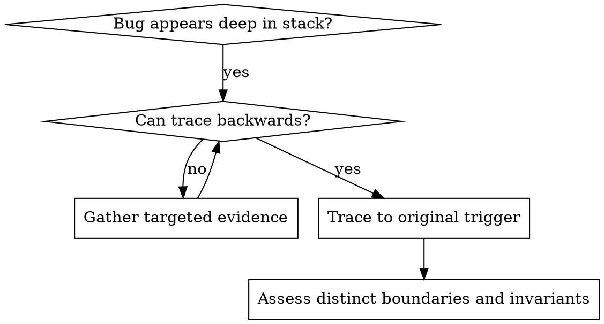
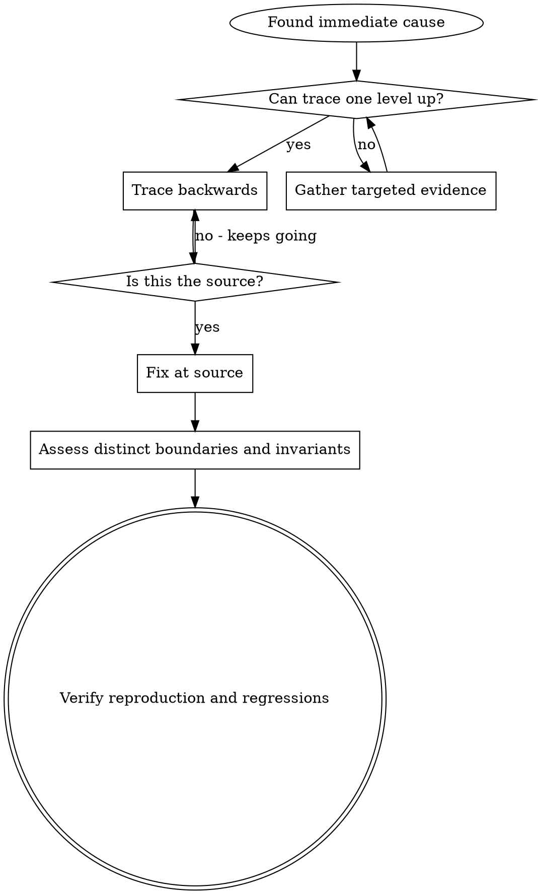

# Root Cause Tracing

## Overview

Bugs often manifest deep in the call stack (git init in wrong directory, file created in wrong location, database opened with wrong path). Your instinct is to fix where the error appears, but that's treating a symptom.

**Core principle:** Trace backward through the call chain until you find the original trigger, then fix at the source.

## When to Use



**Use when:**
- Error happens deep in execution (not at entry point)
- Stack trace shows long call chain
- Unclear where invalid data originated
- Need to find which test/code triggers the problem

## The Tracing Process

### 1. Observe the Symptom
```
Error: git init failed in ~/project/packages/core
```

### 2. Find Immediate Cause
**What code directly causes this?**
```typescript
await execFileAsync('git', ['init'], { cwd: projectDir });
```

### 3. Ask: What Called This?
```typescript
WorktreeManager.createSessionWorktree(projectDir, sessionId)
  → called by Session.initializeWorkspace()
  → called by Session.create()
  → called by test at Project.create()
```

### 4. Keep Tracing Up
**What value was passed?**
- `projectDir = ''` (empty string!)
- In this failure, the process wrapper treats an empty `cwd` as `process.cwd()`; verify the actual wrapper/runtime behavior rather than assuming it
- That's the source code directory!

### 5. Find Original Trigger
**Where did empty string come from?**
```typescript
const context = setupCoreTest(); // Returns { tempDir: '' }
Project.create('name', context.tempDir); // Accessed before beforeEach!
```

## Adding Stack Traces

Start with existing error stacks and caller searches. If the caller remains unclear, set a breakpoint before the problematic operation in an isolated reproduction and inspect the call stack. Avoid running a destructive operation merely to collect a trace.

If a debugger is unavailable, add a temporary, narrowly scoped probe. For an empty-directory hypothesis, begin with a presence flag rather than dumping paths or environment values:

```typescript
// Temporary probe in an isolated reproduction; remove after diagnosis.
async function gitInit(directory: string) {
  console.error('git_init_directory_check', {
    directoryMissing: directory.trim() === '',
  });

  await execFileAsync('git', ['init'], { cwd: directory });
}
```

Use the existing diagnostic channel if it is visible to the test runner; temporary stderr output is an option when that channel is suppressed. Run the smallest reproducer with a disposable working directory and no access to real resources. Preserve the test exit status and relevant failure output instead of filtering away evidence.

Capture `new Error().stack` only if caller identity is still needed, for the suspect call rather than every operation. Stack traces can reveal sensitive paths; inspect locally, redact before retention or sharing, and avoid raw arguments, payloads, or environment dumps. Bound diagnostic volume and duration. Remove the probe after diagnosis; retain telemetry only for a concrete operational requirement with safe fields and access/retention controls.

**Analyze stack traces:**
- Look for test file names
- Find the line number triggering the call
- Identify the pattern (same test? same parameter?)

## Finding Which Test Causes Pollution

If something appears during tests but you don't know which test:

Use the test-isolation helper `find-polluter.sh` in this directory in a disposable checkout, with the target artifact absent initially:

```bash
./find-polluter.sh '.git' 'src/**/*.test.ts'
```

It runs test files one-by-one, not by bisection, and stops at the first observed polluter. It suppresses test output and ignores test exit codes, so rerun the identified test directly for diagnostic evidence. No detected artifact does not prove tests passed or rule out order-dependent pollution; preserve the failing test order when investigating shared-state failures. See script for usage.

## Real Example: Empty projectDir

**Symptom:** `.git` created in `packages/core/` (source code)

**Trace chain:**
1. `git init` runs in `process.cwd()` ← empty cwd parameter
2. WorktreeManager called with empty projectDir
3. Session.create() passed empty string
4. Test accessed `context.tempDir` before beforeEach
5. setupCoreTest() returns `{ tempDir: '' }` initially

**Root cause:** Top-level variable initialization accessing empty value

**Fix:** Move project creation into the initialized test lifecycle. Make the fixture's tempDir getter throw if accessed before beforeEach instead of returning an empty placeholder.

**Assess remaining failure modes:**
- If `Project.create()` accepts untrusted directory input, enforce the explicit-directory contract there.
- Internal workspace/session helpers can rely on that contract when they only forward unchanged data. Add a check elsewhere only for an independent entry point or a distinct invariant; see `defense-in-depth.md`.
- Keep test resource isolation in the fixture/harness rather than adding a production `NODE_ENV` branch. A production filesystem restriction needs its own concrete safety requirement, not this fixture bug alone.
- Remove temporary stack logging once it identifies the caller.

**Regression verification:** Reproduce premature fixture access before the fix, then verify it fails clearly without launching a process. Verify initialized fixture use succeeds and leaves the source tree untouched in an isolated run. Test invalid external input separately if that boundary check is retained, then run the relevant suite.

## Key Principle



Trace back to the original trigger rather than only suppressing the visible error. If evidence remains insufficient, record the uncertainty and the next targeted observation; do not claim a confirmed root cause or guaranteed prevention.
