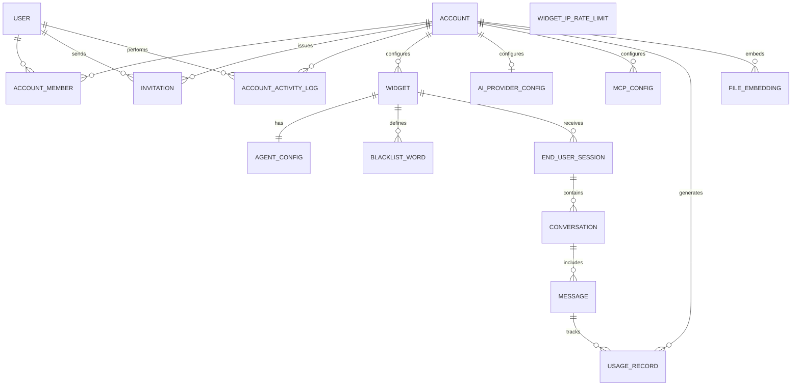

# Conceptual Entity Relationship Diagram

Entities and relationships only — no columns or types. Column-level design is deferred until each module's implementation settles on what it actually needs.

