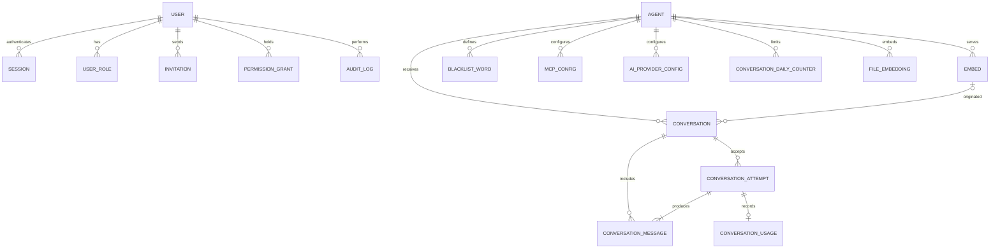

# Conceptual Entity Relationship Diagram

This diagram models the desired entities and relationships. Implementation schemas remain authoritative for columns and types.

```mermaid
erDiagram
    USER
    SESSION
    USER_ROLE
    INVITATION
    PERMISSION_GRANT
    AUDIT_LOG

    AGENT
    EMBED
    BLACKLIST_WORD

    MCP_CONFIG
    AI_PROVIDER_CONFIG

    CONVERSATION
    CONVERSATION_ATTEMPT
    CONVERSATION_MESSAGE
    CONVERSATION_DAILY_COUNTER

    FILE_EMBEDDING
    CONVERSATION_USAGE

    USER ||--o{ SESSION : authenticates
    USER ||--o{ USER_ROLE : has
    USER ||--o{ INVITATION : sends
    USER ||--o{ PERMISSION_GRANT : holds
    USER ||--o{ AUDIT_LOG : performs

    AGENT ||--o{ EMBED : serves
    AGENT ||--o{ BLACKLIST_WORD : defines
    AGENT ||--o{ MCP_CONFIG : configures
    AGENT ||--o{ AI_PROVIDER_CONFIG : configures
    AGENT ||--o{ FILE_EMBEDDING : embeds

    AGENT ||--o{ CONVERSATION : receives
    AGENT ||--o{ CONVERSATION_DAILY_COUNTER : limits
    EMBED o|--o{ CONVERSATION : originated
    CONVERSATION ||--o{ CONVERSATION_ATTEMPT : accepts
    CONVERSATION ||--o{ CONVERSATION_MESSAGE : includes
    CONVERSATION_ATTEMPT ||--|{ CONVERSATION_MESSAGE : produces
    CONVERSATION_ATTEMPT ||--o| CONVERSATION_USAGE : records
```

A client-issued UUID identifies and authorizes a conversation. An embed's public token and `accessVersion` establish initial access. Embed rotation, reassignment, or deletion revokes access; a nullable embed reference preserves history after embed deletion. Agent deletion cascades conversations, attempts, messages, daily counters, and usage.
