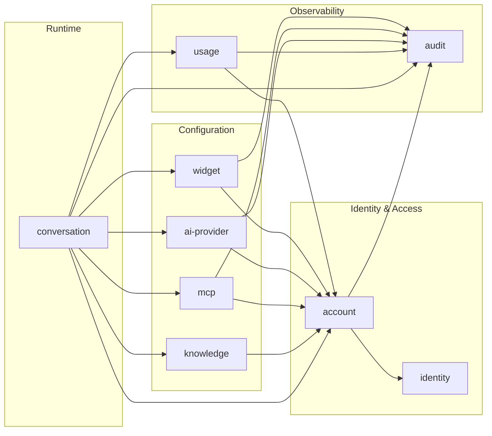

# Module Architecture

Talqo is a modular monolith: one API process (`apps/api`), one PostgreSQL database. Business capabilities live in modules under `apps/api/src/modules/<module>`, each owning its own tables and exposing behavior only through a service. Modules call each other's services directly (in-process), never each other's repositories or tables.

We want a **small, explicit, acyclic** dependency graph: every arrow below is a real service call, there are no cycles, and most modules have at most one outgoing dependency (on `account`).

## Module Dependency Graph

`identity` and `audit` are leaves: they never call another module. `audit` only ever receives calls (a write sink for activity log entries). `conversation` is the only orchestrator — it owns the single user-visible "send a message" operation and fans out to every module needed to answer it, per the rule that the module owning a user-visible operation orchestrates the others.

## Modules

| Module | Owns (tables) | Responsibility |
|---|---|---|
| `identity` | `USER`, `PASSWORD_RESET_TOKEN` | Who a person is: login credentials, password reset. No knowledge of accounts or roles. |
| `account` | `ACCOUNT`, `ACCOUNT_MEMBER`, `INVITATION` | Tenant/billing entity plus RBAC membership and invite flow — owns "who can do what in which account." Replaces the old global `ADMIN_USER`/`ADMIN_ACCESS_LOG` superuser model. |
| `widget` | `WIDGET`, `BOT_CONFIG`, `BLACKLIST_WORD`, `WIDGET_IP_RATE_LIMIT` | Per-widget branding, persona, and content policy. One account owns many widgets. |
| `ai-provider` | `AI_PROVIDER_CONFIG` | Account-level LLM provider credentials and model selection. |
| `mcp` | `CUSTOM_MCP_SERVER`, `PRE_MADE_MCP_SERVER`, `ACCOUNT_PRE_MADE_MCP` | Tool-server integrations: custom servers and the shared catalog. |
| `knowledge` | `FILE_EMBEDDING` | RAG ingestion and embedding store, decoupled from live chat. |
| `conversation` | `END_USER_SESSION`, `CONVERSATION`, `MESSAGE` | Chat runtime; orchestrates a reply using widget config, the AI provider, MCP tools, and knowledge. |
| `usage` | `USAGE_RECORD` | Meters tokens/cost per message; enforces account usage limits. |
| `audit` | `ACCOUNT_ACTIVITY_LOG` | Sink module: records actions performed by other modules against an account. No outgoing dependencies. |

Every surviving entity from [`docs/erd/main-mermaid.md`](../erd/main-mermaid.md) is owned by exactly one module, matching the "a module writes only its own tables" rule.

## RBAC replaces back-office

The old model had a single `CLIENT` (tenant + login combined) and a separate global `ADMIN_USER` with an `ADMIN_ACCESS_LOG`. There is no back-office app or superuser role in the new model:

- `ACCOUNT` (tenant/billing) and `USER` (login identity) are split, because more than one user can now access one account.
- `ACCOUNT_MEMBER` joins `ACCOUNT` and `USER` with a `role` (owner/admin/member/viewer) — this join table **is** the RBAC mechanism. "Admin" becomes a role scoped to one account, not a global superuser class.
- `ACCOUNT_ACTIVITY_LOG` replaces `ADMIN_ACCESS_LOG`: every entry is scoped to an account, and the actor is a normal `USER` acting through their `ACCOUNT_MEMBER` role.
- `INVITATION` replaces `PENDING_REGISTRATION`: instead of open self-registration, an existing account member invites an email address into the account with a role.
- `WIDGET` moves from a 1:1 config on `CLIENT` to a 1:many child of `ACCOUNT`, enabling multiple widgets per account. `BOT_CONFIG` and `BLACKLIST_WORD` move with it, since persona and content policy are naturally per-widget once widgets multiply.
