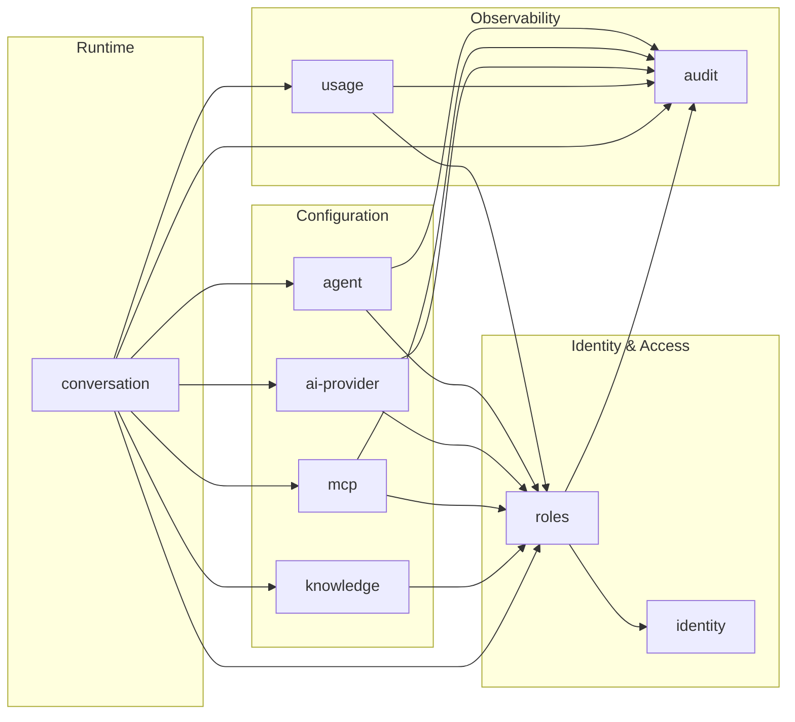

# Module Architecture

Talqo is a modular monolith: one API process (`apps/api`), one PostgreSQL database. Business capabilities live in modules under `apps/api/src/modules/<module>`, each owning its own tables and exposing behavior only through a service. Modules call each other's services directly (in-process), never each other's repositories or tables.

We want a **small, explicit, acyclic** dependency graph: every arrow below is a real service call, there are no cycles, and most modules have at most one outgoing dependency (on `roles`).

## Module Dependency Graph

`identity` and `audit` are leaves: they never call another module. `audit` only ever receives calls (a write sink for activity log entries). `conversation` is the only orchestrator — it owns the single user-visible "send a message" operation and fans out to every module needed to answer it, per the rule that the module owning a user-visible operation orchestrates the others.

## Modules

| Module | Owns (tables) | Responsibility |
|---|---|---|
| `identity` | `USER` | Who a person is: login credentials. No knowledge of roles. |
| `roles` | `USER_ROLE`, `INVITATION` | RBAC role assignment and invite flow — owns "who can do what." |
| `agent` | `AGENT`, `AGENT_CONFIG`, `BLACKLIST_WORD`, `AGENT_IP_RATE_LIMIT` | Per-agent branding, persona, and content policy. |
| `ai-provider` | `AI_PROVIDER_CONFIG` | App-level LLM provider credentials and model selection. |
| `mcp` | `MCP_CONFIG` | Tool-server integrations configured once for the app, shared across all agents. |
| `knowledge` | `FILE_EMBEDDING` | RAG ingestion and per-agent embedding store, decoupled from live chat. |
| `conversation` | `END_USER_SESSION`, `CONVERSATION`, `MESSAGE` | Chat runtime; orchestrates a reply using agent config, the AI provider, MCP tools, and knowledge. |
| `usage` | `USAGE_RECORD` | Meters tokens/cost per message; enforces usage limits. |
| `audit` | `AUDIT_LOG` | Sink module: records actions performed by other modules. No outgoing dependencies. |

Every entity in [`docs/ERD.md`](../ERD.md) is owned by exactly one module, matching the "a module writes only its own tables" rule.
