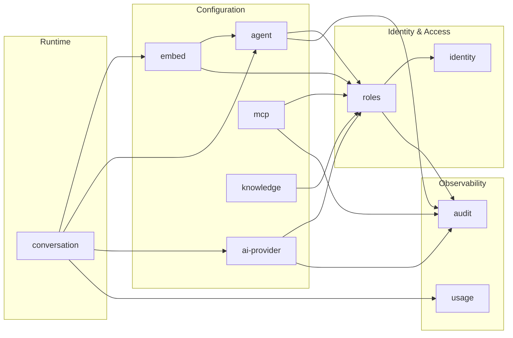

# Module Architecture

Talqo is a modular monolith: one API process (`apps/api`), one PostgreSQL database. Business capabilities live in modules under `apps/api/src/modules/<module>`, each owning its own tables and exposing behavior only through a service. Modules call each other's services directly (in-process), never each other's repositories or tables.

We want a **small, explicit, acyclic** dependency graph: every arrow below is a real runtime service call and there are no cycles. Schema-only foreign-key imports used for deletion integrity are not service arrows.

## Module Dependency Graph

```mermaid
graph LR
    subgraph "Identity & Access"
        identity[identity]
        roles[roles]
    end

    subgraph "Configuration"
        agent[agent]
        embed[embed]
        ai_provider["ai-provider"]
        mcp[mcp]
        knowledge[knowledge]
    end

    subgraph "Runtime"
        conversation[conversation]
    end

    subgraph "Observability"
        usage[usage]
        audit[audit]
    end

    roles --> identity

    agent --> roles
    embed --> agent
    embed --> roles
    ai_provider --> roles
    mcp --> roles
    knowledge --> roles

    conversation --> embed
    conversation --> agent
    conversation --> ai_provider
    conversation --> usage

    roles --> audit
    agent --> audit
    mcp --> audit
    ai_provider --> audit
```

`identity`, `usage`, and `audit` are leaves. `audit` only receives calls as an activity-log sink. `conversation` owns the public send operation and calls only the configuration and persistence capabilities currently needed for text chat. Knowledge retrieval and MCP execution are outside the implemented chat path.

## Modules

| Module | Owns (tables) | Responsibility |
|---|---|---|
| `identity` | `USER`, `SESSION` | Who a person is: login credentials and active sessions. No knowledge of roles. |
| `roles` | `USER_ROLE`, `INVITATION`, `PERMISSION_GRANT` | RBAC role assignment, invite flow, and deployment-global permission grants — owns "who can do what." |
| `agent` | `AGENT`, `BLACKLIST_WORD` | Deployment-owned agent identity, system prompt, and literal output blacklist. |
| `embed` | `EMBED` | Embeddable surfaces: appearance, public embed token, access version, and the agent each one serves. One agent serves many embeds. |
| `ai-provider` | `AI_PROVIDER_CONFIG` | App-level LLM provider credentials and model selection. |
| `mcp` | `MCP_CONFIG` | Tool-server integrations configured once for the app, shared across all agents. |
| `knowledge` | `FILE_EMBEDDING` | RAG ingestion and per-agent embedding store, decoupled from live chat. |
| `conversation` | `CONVERSATION_SESSION`, `CONVERSATION`, `CONVERSATION_ATTEMPT`, `CONVERSATION_MESSAGE`, `CONVERSATION_DAILY_COUNTER` | Public multi-turn runtime, bearer authorization, complete-history prompt assembly, accepted-question counters, and fenced generation leases. |
| `usage` | `CONVERSATION_USAGE` | Stores normalized input/output usage once per model-call attempt; it does not enforce billing or deployment quotas. |
| `audit` | `AUDIT_LOG` | Sink module: records actions performed by other modules. No outgoing dependencies. |

Every entity in [`docs/ERD.md`](../ERD.md) is owned by exactly one module, matching the "a module writes only its own tables" rule.
