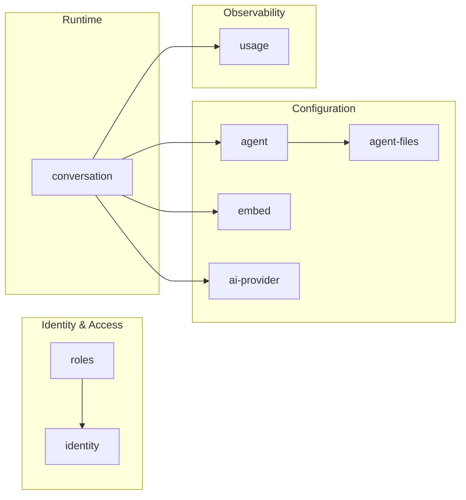

# Module Architecture

Talqo is a modular monolith: one API process (`apps/api`), one PostgreSQL database. Business capabilities live in modules under `apps/api/src/modules/<module>`, each owning its own tables and exposing behavior only through a service. Modules call each other's services directly (in-process), never each other's repositories or tables.

We want a **small, explicit, acyclic** dependency graph: every arrow below is a runtime service call in the implemented architecture and there are no cycles. Schema-only foreign-key imports used for deletion integrity are not service arrows.

## Module Dependency Graph

```mermaid
graph LR
    subgraph "Identity & Access"
        identity[identity]
        roles[roles]
    end

    subgraph "Configuration"
        agent[agent]
        agent_files["agent-files"]
        embed[embed]
        ai_provider["ai-provider"]
    end

    subgraph "Runtime"
        conversation[conversation]
    end

    subgraph "Observability"
        usage[usage]
    end

    roles --> identity
    agent --> agent_files

    conversation --> embed
    conversation --> agent
    conversation --> ai_provider
    conversation --> usage
```

`identity`, `agent-files`, and `usage` are leaves. `conversation` owns the public send operation and conversation persistence; it orchestrates embed validation, agent prompt composition, the ai-provider text operation, and usage recording through service interfaces.

## Modules

| Module | Owns (tables) | Responsibility |
|---|---|---|
| `identity` | `USER`, `SESSION` | Who a person is: login credentials and active sessions. No knowledge of roles. |
| `roles` | `USER_ROLE`, `INVITATION`, `PERMISSION_GRANT` | RBAC role assignment, invite flow, and deployment-global permission grants — owns "who can do what." |
| `agent` | `AGENT`, `BLACKLIST_WORD` | Deployment-owned response configuration: identity, saved system prompt, output blacklist, and platform prompt composition. |
| `agent-files` | — (local filesystem) | Uploaded context documents per agent: validation, storage, and retrieval. |
| `embed` | `EMBED` | Embeddable surfaces: appearance, public embed token, access version, and the agent each one serves. One agent serves many embeds. |
| `ai-provider` | `AI_PROVIDER_CONFIG` | Deployment-wide (singleton) provider configuration: credentials and per-operation model selection. |
| `conversation` | `CONVERSATION`, `GENERATION_ATTEMPT`, `MESSAGE`, `CONVERSATION_DAILY_COUNTER` | Public multi-turn runtime, bearer authorization, conversation history, accepted-question counters, and fenced generation leases. |
| `usage` | `USAGE_RECORD` | Stores normalized input/output usage once per generation attempt; it does not enforce billing or deployment quotas. |

Every entity in [`docs/ERD.md`](../ERD.md) is owned by exactly one module, matching the "a module writes only its own tables" rule. Planned modules such as knowledge retrieval, MCP tools, and audit logging are tracked in [`docs/SRS.md`](../SRS.md) and join this graph when implemented.
