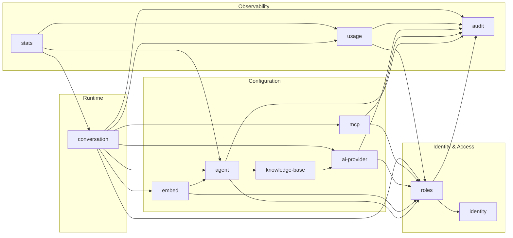

# Module Architecture

Talqo is a modular monolith: one API process (`apps/api`), one PostgreSQL database. Business capabilities live in modules under `apps/api/src/modules/<module>`, each owning its own tables and exposing behavior only through a service. Modules call each other's services directly (in-process), never each other's repositories or tables.

We want a **small, explicit, acyclic** dependency graph: every arrow below is a real service call, there are no cycles, and most modules have at most one outgoing dependency (on `roles`).

## Module Dependency Graph

```mermaid
graph LR
    subgraph "Identity & Access"
        identity[identity]
        roles[roles]
    end

    subgraph "Configuration"
        agent[agent]
        knowledge_base[knowledge-base]
        embed[embed]
        ai_provider["ai-provider"]
        mcp[mcp]
    end

    subgraph "Runtime"
        conversation[conversation]
    end

    subgraph "Observability"
        usage[usage]
        stats[stats]
        audit[audit]
    end

    roles --> identity

    agent --> roles
    agent --> knowledge_base
    embed --> agent
    embed --> roles
    ai_provider --> roles
    mcp --> roles
    knowledge_base --> ai_provider
    usage --> roles

    conversation --> embed
    conversation --> agent
    conversation --> ai_provider
    conversation --> mcp
    conversation --> usage
    conversation --> roles

    stats --> conversation
    stats --> usage
    stats --> agent

    roles --> audit
    agent --> audit
    mcp --> audit
    ai_provider --> audit
    usage --> audit
    conversation --> audit
```

`identity` and `audit` are leaves: they never call another module. `audit` only ever receives calls (a write sink for activity log entries). `conversation` orchestrates sending messages. `stats` owns no tables: it composes the operator statistics read model from other modules' services. Separately, `knowledge-base` owns source-file lifecycle and serial ingestion, calling the configured embedding provider.

## Modules

| Module | Owns (tables) | Responsibility |
|---|---|---|
| `identity` | `USER`, `SESSION` | Who a person is: login credentials and active sessions. No knowledge of roles. |
| `roles` | `USER_ROLE`, `INVITATION`, `PERMISSION_GRANT` | RBAC role assignment, invite flow, and deployment-global permission grants — owns "who can do what." |
| `agent` | `AGENT`, `BLACKLIST_WORD` | Deployment-owned agent branding, persona, and content policy. |
| `embed` | `EMBED` | Embeddable surfaces: appearance, public embed token, and the agent each one serves. One agent serves many embeds. |
| `ai-provider` | `AI_PROVIDER_CONFIG` | Per-agent model-provider credentials and model selection. |
| `mcp` | `MCP_SERVER` | Per-agent tool-server integrations over Streamable HTTP or stdio, with encrypted credentials, OAuth, and tool resolution during chat. One agent serves many connections. |
| `knowledge-base` | `agent_file`, `agent_file_chunk`; original uploads on disk | Agent source-file lifecycle, durable serial ingestion, Docling conversion/chunking, and per-agent pgvector storage; no chat retrieval yet. |
| `conversation` | `CONVERSATION`, `GENERATION_ATTEMPT`, `MESSAGE`, `CONVERSATION_DAILY_COUNTER` | Chat runtime; orchestrates a reply using agent config and the AI provider. Knowledge retrieval is future work. |
| `usage` | `USAGE_RECORD` | Meters tokens/cost per generation attempt; limit enforcement lives in `conversation`. |
| `stats` | none — read model over `conversation`, `usage`, `agent` | Operator statistics behind `GET /api/stats`; its dev fixtures write across modules as the recorded exception. |
| `audit` | `AUDIT_LOG` | Sink module: records actions performed by other modules. No outgoing dependencies. |

Every entity in [`docs/ERD.md`](../ERD.md) is owned by exactly one module, matching the "a module writes only its own tables" rule.
